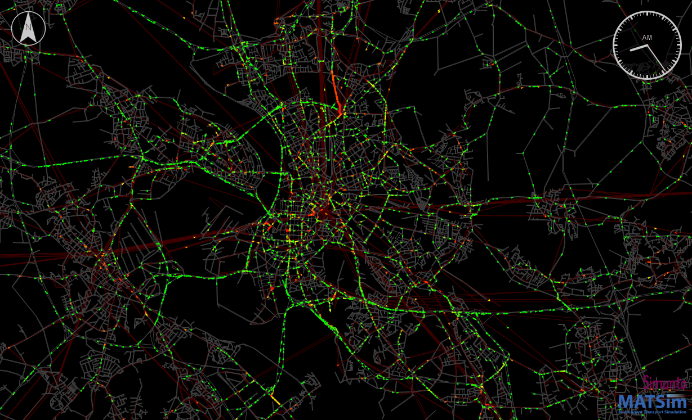
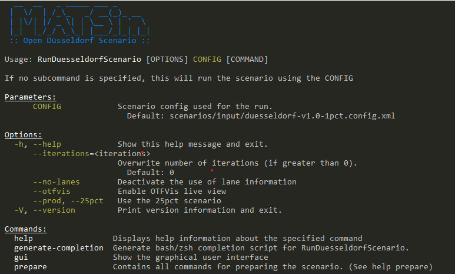

# The MATSim Open Düsseldorf Scenario

### About this project

This repository provides an open MATSim transport model for Düsseldorf, provided by the [Transport Systems Planning and Transport Telematics group](https://www.vsp.tu-berlin.de) of [Technische Universität Berlin](http://www.tu-berlin.de).

> Currently, there are two pre-release versions available for testing

This scenario contains a 1pct and 25pct sample of Düsseldorf and its surrounding area; road capacities are accordingly reduced. The scenario is calibrated taking into consideration the traffic counts, modal split and mode-specific trip distance distributions.

### Licenses

The **MATSim program code** in this repository is distributed under the terms of the [GNU General Public License as published by the Free Software Foundation (version 2)](https://www.gnu.org/licenses/old-licenses/gpl-2.0.en.html). The MATSim program code are files that reside in the `src` directory hierarchy and typically end with `*.java`.

The **MATSim input files, output files, analysis data and visualizations** are licensed under a <a rel="license" href="http://creativecommons.org/licenses/by/4.0/">Creative Commons Attribution 4.0 International License</a>.
  MATSim input files are those that are used as input to run MATSim. They often, but not always, have a header pointing to matsim.org. They typically reside in the `scenarios` directory hierarchy. MATSim output files, analysis data, and visualizations are files generated by MATSim runs, or by postprocessing.  They typically reside in a directory hierarchy starting with `output`.

**Other data files**, in particular in `original-input-data`, have their own individual licenses that need to be individually clarified with the copyright holders.

### Note

Handling of large files within git is not without problems (git lfs files are not included in the zip download; we have to pay; ...).  In consequence, large files, both on the input and on the output side, reside at https://svn.vsp.tu-berlin.de/repos/public-svn/matsim/scenarios/countries/de/duesseldorf .  

----
### Run the MATSim Düsseldorf scenario

The Düsseldorf scenario has a command line interface providing the following options:

It can be used by using either of these methods:

##### ... using an IDE, e.g. Eclipse, IntelliJ - Alternative 1: use cloned/downloaded matsim-duesseldorf repository
(Requires either cloning or downloading the repository.)

1. Set up the project in your IDE.
1. Make sure the project is configured as maven project.
1. Run the JAVA class `src/main/java/org/matsim/run/RunDuesseldorfScenario.java`.
1. "Open" the output directory.  You can drag files into VIA as was already done above.
1. Edit the config file or adjust the run class. Re-run MATSim.

##### ... using a runnable jar file
(Requires either cloning or downloading the repository and java & maven)

1. Build the scenario using `mvn package`
1. There should be a file directly in the `matsim-duesseldorf` directory with name approximately as `matsim-duesseldorf-1.0.jar`.
1. Run this file from the command line using `java -jar matsim-duesseldorf-1.0.jar --help` to see all possible options.
    1. For example, one can disable lanes or run the 25pct scenario using the available options
1. Start this scenario using the default config by running `java -jar matsim-duesseldorf-1.0.jar`
1. "Open" the output directory.  You can drag files into VIA as was already done above.

## More information

Please visit https://vsp.berlin/simwrapper/komodnext to see application of the scenario. 

A description of the scenario and methology can be found in the Paper ["Investigation of the system-wide effects of intelligent infrastructure concepts with microscopic and mesoscopic traffic simulation"](https://elib.dlr.de/144810/)

For more information about MATSim, see here: https://www.matsim.org/

## Internal documentation

Documents can be found at https://drive.google.com/drive/folders/1Xb7iXquDb9OCMZJC4MEp3h4tPEZtBw18?usp=drive_link and https://svn.vsp.tu-berlin.de/repos/shared-svn/projects/komodnext/doc/
